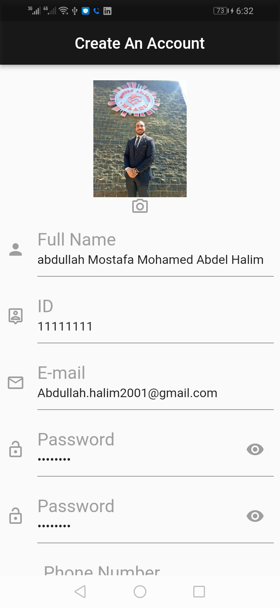
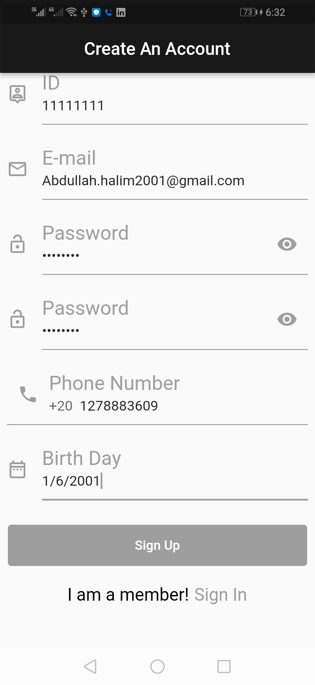
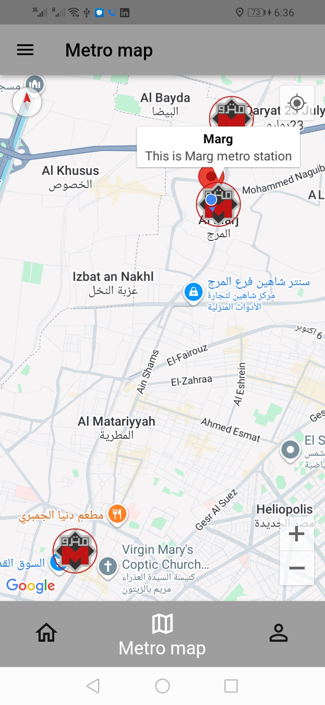
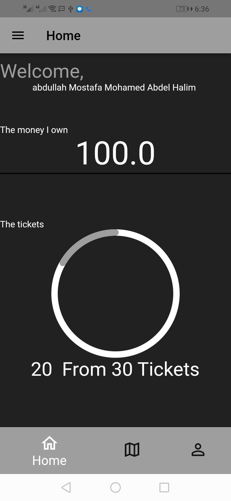
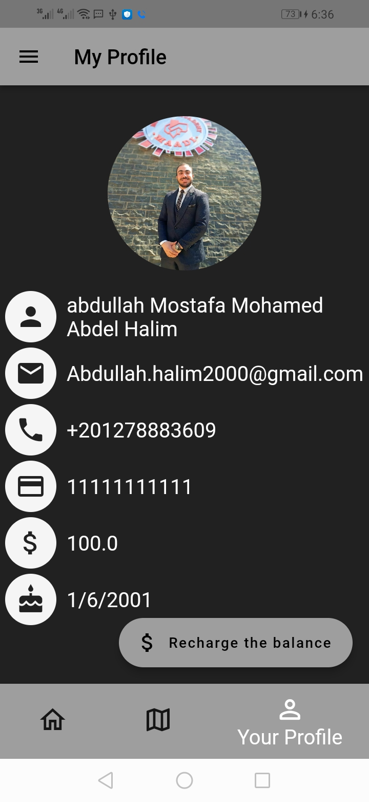
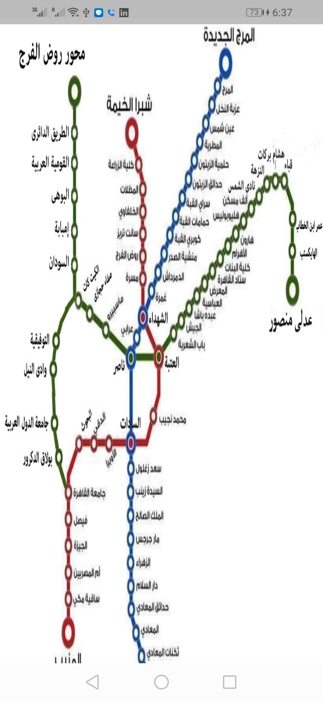
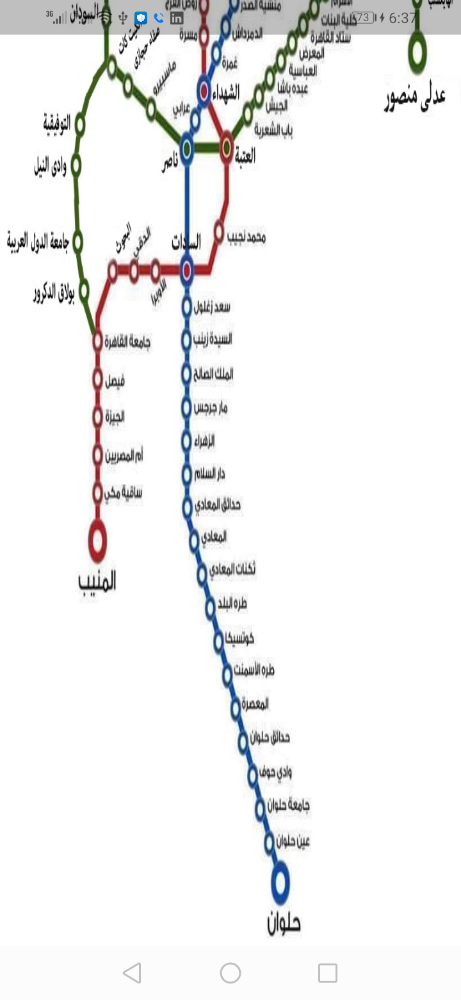
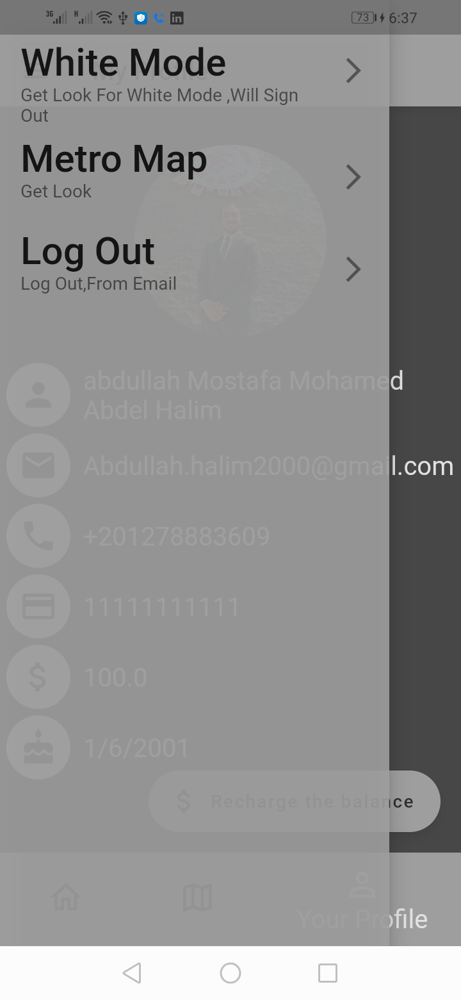
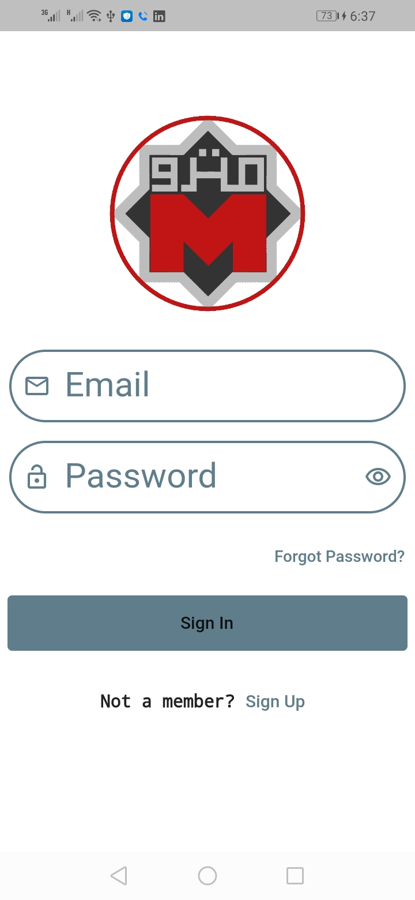
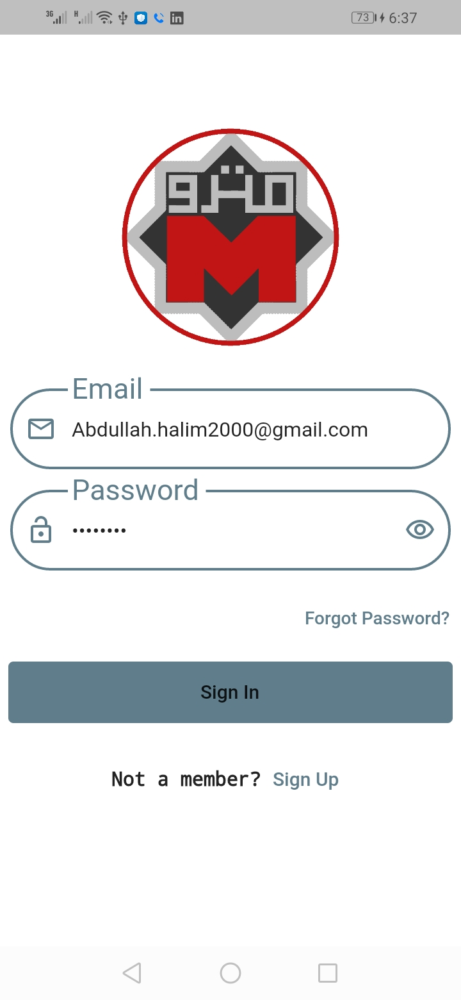

# Sefty-metro

A mobile app for the Egyptian Metro that allows users to:
- Buy tickets.
- Find the nearest metro station via Google Maps.
- Save customer data using Firebase.
- Automatically calculate and deduct taxes.
- Support payments through Visa or Fawry via Paymob.
- Issue tickets via NFC or QR Code scanning and deduct trip amounts.

---

## App Screenshots

Here are some screenshots from the application:

---

## Getting Started

This project is a starting point for a Flutter application.

Useful resources to get you started:
- [Lab: Write your first Flutter app](https://docs.flutter.dev/get-started/codelab)
- [Cookbook: Useful Flutter samples](https://docs.flutter.dev/cookbook)

For help with Flutter development:
- [Flutter Documentation](https://docs.flutter.dev/)
